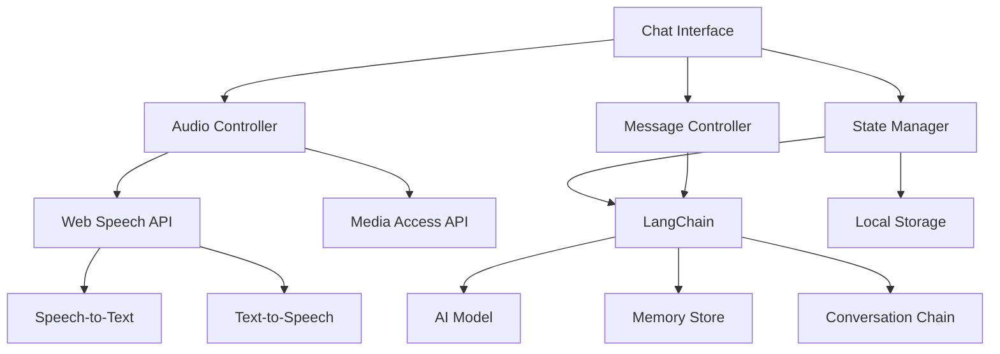

# Design Document

## Overview

The minimal chat interface will be a single-page web application built with a modern frontend framework (React, Vue, or Svelte). It leverages the Web Speech API for audio capabilities and LangChain for AI model interactions and state management. The design provides a clean, responsive interface for text and voice interactions with AI models, prioritizing simplicity, accessibility, and progressive enhancement while utilizing component-based architecture.

## Architecture

### High-Level Architecture



### Technology Stack

- **Frontend Framework**: React, Vue, or Svelte (component-based architecture)
- **AI Integration**: LangChain.js for AI model interactions, conversation chains, and memory management
- **Audio Processing**: Web Speech API (SpeechRecognition, SpeechSynthesis)
- **Media Access**: MediaDevices.getUserMedia() for microphone access
- **State Management**: Framework-native state management integrated with LangChain memory stores
- **Storage**: localStorage for conversation persistence, LangChain memory for conversation context
- **Styling**: CSS3 with CSS Grid/Flexbox for responsive layout, framework-compatible styling approach
- **Build Tool**: Vite or framework-specific CLI for development and bundling

## Components and Interfaces

### 1. Chat Interface Component (`ChatInterface`)

**Responsibilities:**
- Render chat messages and input controls using framework components
- Handle user interactions (typing, clicking, keyboard shortcuts)
- Manage UI state (loading, recording, error states) through framework state management

**Key Props/Methods:**
- `messages`: Array of chat messages to display
- `onSubmit(message)`: Process text message submission
- `onToggleRecording()`: Start/stop audio recording
- `isLoading`: Loading state for UI feedback
- Auto-scroll behavior through framework lifecycle methods

### 2. Message Controller (`MessageController`)

**Responsibilities:**
- Integrate with LangChain conversation chains
- Manage AI model interactions through LangChain
- Handle conversation memory and context
- Process streaming responses

**Key Methods:**
- `sendMessage(text)`: Send text through LangChain conversation chain
- `initializeChain()`: Set up LangChain conversation chain with memory
- `getConversationHistory()`: Retrieve conversation from LangChain memory
- `handleStreamingResponse()`: Process streaming AI responses

**Interface:**
```typescript
interface Message {
  id: string;
  text: string;
  sender: 'user' | 'ai';
  timestamp: Date;
  audioUrl?: string; // Optional audio playback URL
}
```

### 3. Audio Controller (`AudioController`)

**Responsibilities:**
- Handle speech recognition (speech-to-text)
- Manage text-to-speech synthesis
- Control microphone access and recording state

**Key Methods:**
- `startRecording()`: Begin speech recognition
- `stopRecording()`: End speech recognition and return text
- `speakText(text)`: Convert text to speech and play
- `checkAudioSupport()`: Verify browser capabilities

**Audio State Management:**
```typescript
interface AudioState {
  isRecording: boolean;
  isPlaying: boolean;
  isSupported: boolean;
  hasPermission: boolean;
  error?: string;
}
```

### 4. State Manager (`StateManager`)

**Responsibilities:**
- Centralized state management integrated with LangChain
- Synchronize UI state with LangChain memory stores
- Persist conversation history and context
- Handle state updates and notifications

**Key Methods:**
- `setState(updates)`: Update application state and sync with LangChain
- `getState()`: Get current state from both UI and LangChain stores
- `subscribe(callback)`: Listen for state changes from UI and LangChain
- `persistState()`: Save to localStorage and LangChain memory
- `syncWithLangChain()`: Synchronize state between UI and LangChain memory

### 5. LangChain Integration (`LangChainService`)

**Responsibilities:**
- Configure and initialize LangChain conversation chains
- Manage AI model connections and configurations
- Handle conversation memory and context persistence
- Process streaming responses and token management

**Key Methods:**
- `initializeChain(modelConfig)`: Set up conversation chain with specified AI model
- `createMemoryStore()`: Initialize conversation memory (buffer, summary, or vector store)
- `sendMessage(message, context)`: Send message through conversation chain
- `getConversationContext()`: Retrieve current conversation context from memory
- `configureModel(settings)`: Configure AI model parameters (temperature, max tokens, etc.)

**LangChain Components:**
```typescript
interface LangChainConfig {
  model: {
    provider: 'openai' | 'anthropic' | 'local';
    modelName: string;
    temperature: number;
    maxTokens: number;
  };
  memory: {
    type: 'buffer' | 'summary' | 'vector';
    maxTokenLimit?: number;
    returnMessages?: boolean;
  };
  chain: {
    type: 'conversation' | 'retrieval_qa';
    verbose?: boolean;
  };
}
```

## Data Models

### Application State

```typescript
interface AppState {
  messages: Message[];
  currentInput: string;
  isLoading: boolean;
  audioState: AudioState;
  langChainState: LangChainState;
  error?: string;
  settings: {
    autoScroll: boolean;
    audioEnabled: boolean;
    voiceSettings: {
      rate: number;
      pitch: number;
      voice?: string;
    };
    aiModel: LangChainConfig;
  };
}

interface LangChainState {
  isInitialized: boolean;
  currentModel: string;
  conversationId: string;
  tokenCount: number;
  memorySize: number;
  isStreaming: boolean;
}
```

### Message Model

```typescript
interface Message {
  id: string;
  text: string;
  sender: 'user' | 'ai';
  timestamp: Date;
  audioUrl?: string;
  status: 'sending' | 'sent' | 'error';
}
```

## Error Handling

### Audio Permission Errors
- **Strategy**: Graceful degradation to text-only mode
- **Implementation**: Check permissions on load, show clear messaging if denied
- **Fallback**: Disable audio buttons and show text-only interface

### Network Errors
- **Strategy**: Retry mechanism with exponential backoff
- **Implementation**: Show connection status, allow manual retry
- **Fallback**: Queue messages locally until connection restored

### Speech Recognition Errors
- **Strategy**: Provide visual feedback and alternative input methods
- **Implementation**: Show error messages, automatically fall back to text input
- **Fallback**: Always maintain text input as primary method

### Browser Compatibility
- **Strategy**: Feature detection and progressive enhancement
- **Implementation**: Check for Web Speech API support on initialization
- **Fallback**: Hide unsupported features, maintain core text functionality

## Testing Strategy

### Unit Testing
- **Audio Controller**: Mock Web Speech API, test state transitions
- **Message Controller**: Mock LangChain chains, test conversation flow
- **LangChain Service**: Mock AI model responses, test memory management
- **State Manager**: Test state updates, persistence, and LangChain synchronization
- **UI Components**: Test rendering and user interactions

### Integration Testing
- **Audio Flow**: Test complete speech-to-text-to-LangChain-to-speech cycle
- **Message Flow**: Test end-to-end message flow through LangChain conversation chains
- **Memory Management**: Test conversation context persistence and retrieval
- **Model Switching**: Test switching between different AI models via LangChain
- **Error Scenarios**: Test network failures, AI model errors, permission denials
- **Cross-browser**: Test Web Speech API compatibility

### Accessibility Testing
- **Keyboard Navigation**: Ensure all features accessible via keyboard
- **Screen Readers**: Test with ARIA labels and semantic HTML
- **Voice Control**: Test compatibility with browser voice commands
- **Visual Indicators**: Ensure clear feedback for all states

### Performance Testing
- **Memory Usage**: Monitor for memory leaks in long conversations
- **Audio Processing**: Test performance with continuous speech recognition
- **Responsive Design**: Test across different screen sizes and devices

## Implementation Considerations

### Security
- **HTTPS Required**: Web Speech API requires secure context
- **Permission Handling**: Graceful handling of microphone permission requests
- **Input Sanitization**: Sanitize all user input before display

### Performance
- **Lazy Loading**: Load audio features only when needed
- **Message Virtualization**: Consider virtual scrolling for long conversations
- **Debouncing**: Debounce text input to prevent excessive API calls

### Accessibility
- **ARIA Labels**: Comprehensive labeling for screen readers
- **Keyboard Shortcuts**: Support common keyboard navigation patterns
- **Visual Feedback**: Clear indicators for recording, loading, and error states
- **High Contrast**: Ensure sufficient color contrast for readability